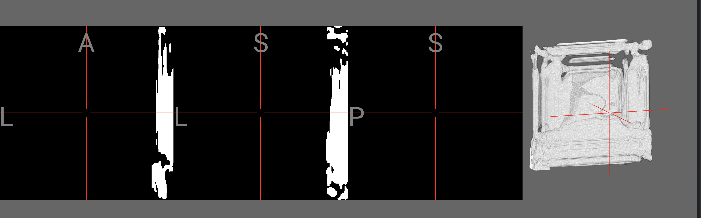

```
uv pip install -e .
python tiny_meshnet.py
```

using default backend (metal in my case), and webgpu produces different results.
```
METAL=1 python tiny_meshnet.py
WEBGPU=1 tiny_meshnet.py
```

or

```
./run.sh
```


produces different nifies (visualized in brainchop.org)





see also

```
metal.nii.gz
webgpu.nii.gz
```
